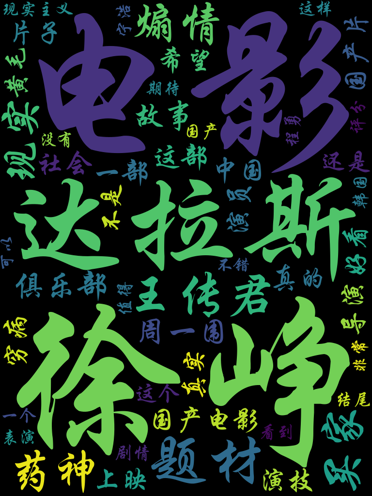
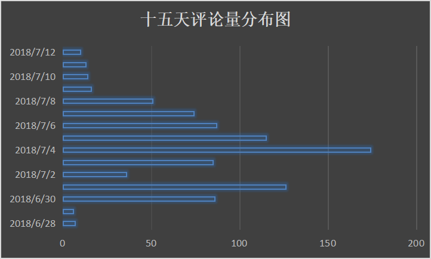
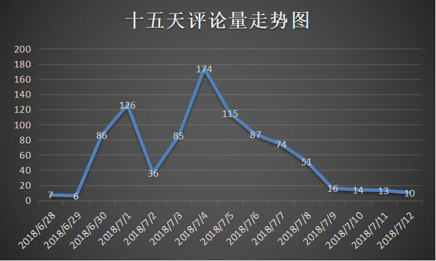

# python-crawler-douban-movie
豆瓣电影（短评）爬虫


#### 爬虫
```
# 爬取到的数据（这里只展示部分数据）
> db.getCollection('movie_26752088_comments').find({}).sort({'date':-1}).limit(3)

/* 1 */
{
    "_id" : ObjectId("5b477a3d14170f331411152d"),
    "author" : "呵呵",
    "date" : ISODate("2018-07-12T08:00:00.000+08:00"),
    "star" : null,
    "vote" : 0,
    "comment" : "想看",
    "is_visit" : false
}

/* 2 */
{
    "_id" : ObjectId("5b477a3d14170f3314111560"),
    "author" : "爱的物语",
    "date" : ISODate("2018-07-12T08:00:00.000+08:00"),
    "star" : null,
    "vote" : 0,
    "comment" : "小病自我診斷\n大病自我了斷\n社會初級階段\n別給國家添亂",
    "is_visit" : false
}

/* 3 */
{
    "_id" : ObjectId("5b477a4014170f33141115d7"),
    "author" : "小小书童",
    "date" : ISODate("2018-07-12T08:00:00.000+08:00"),
    "star" : null,
    "vote" : 0,
    "comment" : "海报跟 辩护人 迷之相似～",
    "is_visit" : false
}
```

#### 分析
- 点赞Top10
- 短评日期分布、走势
- 词频统计（中文分词），生成词云
- 评分阶梯分布、日期分布、日期走势
- 每日评论数走势

###### 词云（词频统计）


###### 15天短评量分布图


###### 15天短评量走势图
